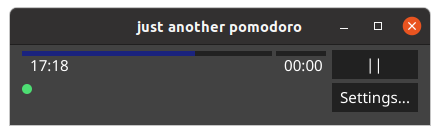

Just Another Pomodoro made with [Go](https://golang.org/) and [fyne](https://fyne.io/) toolkit

### TODO
- ~~gestire la pausa del pomodoro~~
- ~~alert prima della fine della progress bar~~
- ~~add tests~~
- ~~position of tomatoes done at the correct hour~~ 
- implement settings windows:
    1. set timer duration 
    2. set break timer duration
    3. continuous pomodoro
    4. stop at every pomodoro
    5. insert comment on every pomodoro
- sync tomato with remote pair
- sync tomato with github commit
---

